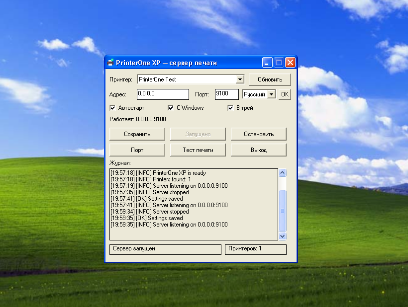
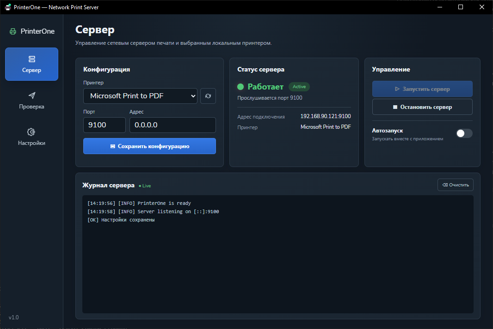
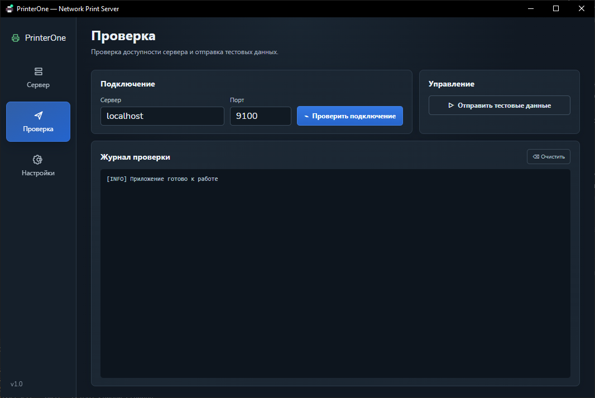
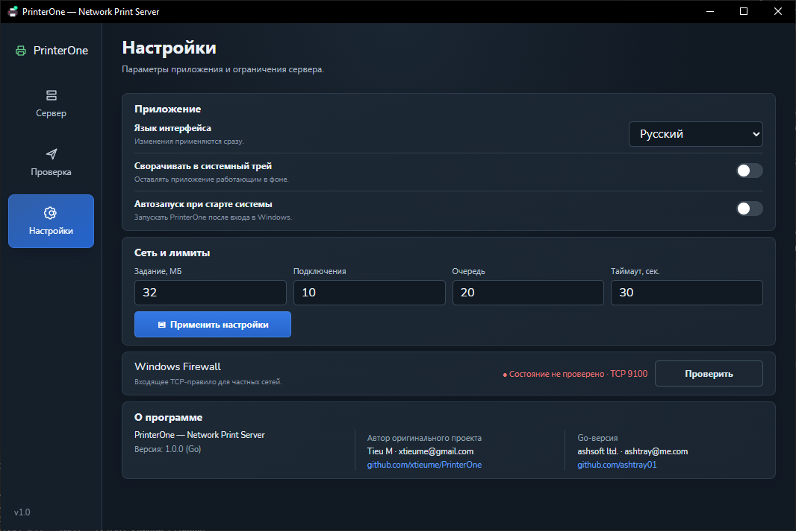
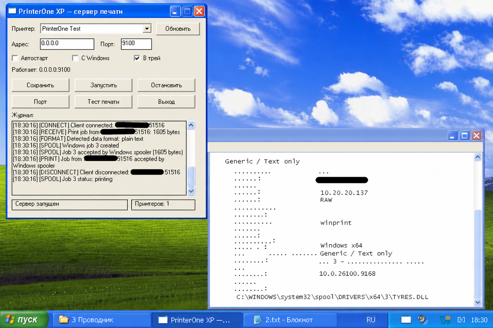

<div align="center">
  
  <h1>PrinterOne</h1>
  <p><strong>Компактный сетевой RAW-сервер печати для Windows</strong></p>

  [](https://github.com/ashtray01/printerone/actions/workflows/ci.yml)
  [](https://github.com/ashtray01/printerone/actions/workflows/legacy-xp.yml)
  [](https://github.com/ashtray01/printerone/releases)
  [](https://go.dev/)
  [](LICENSE)
</div>

<div align="center">
  
  <br>
  <sub>Нативная legacy-редакция PrinterOne на Windows XP SP3</sub>
</div>

PrinterOne принимает задания по TCP из локальной сети и передаёт их без
преобразования выбранному принтеру Windows. Приложение особенно удобно для
термопринтеров, принтеров этикеток, кассового ПО и устройств, отправляющих
ZPL, EPL, TSPL, ESC/POS или другой RAW-поток.

| Редакция | Поддерживаемые системы | Готовый файл |
|:---|:---|:---|
| **Legacy** | Windows XP SP3 и Windows 7 | `PrinterOne-XP-SP3-x86.exe` |
| **Modern** | Windows 10 и Windows 11 | `PrinterOne.exe` |

## Возможности

- выбор любого установленного в Windows принтера;
- стандартный RAW TCP endpoint с отображением готового IP и порта;
- встроенная проверка соединения и отправка тестового задания;
- управление правилом Windows Firewall с явным подтверждением UAC;
- автозапуск приложения вместе с Windows и автозапуск сервера;
- работа в системном трее;
- журнал подключений, заданий, результатов печати и ошибок;
- ограничения размера задания, времени чтения, подключений и очереди;
- русский, английский, немецкий, испанский и упрощённый китайский интерфейс;
- один переносимый `PrinterOne.exe`, не требующий Python или Node.js.

### Современный интерфейс Windows 10/11



| Проверка подключения | Настройки |
|:---:|:---:|
|  |  |

## Windows XP SP3 и Windows 7

Для Windows XP SP3 и Windows 7 выпускается отдельный нативный
`PrinterOne-XP-SP3-x86.exe`. Он не использует Wails, WebView2, .NET или внешние
DLL, собирается Go 1.10.8 и хранит настройки отдельно в
`%APPDATA%\PrinterOne-XP`. Серверная логика, лимиты, очередь, RAW Winspool,
автозапуск, tray, журнал и тестовая печать сохранены. Интерфейс поддерживает
русский, английский, немецкий и испанский языки. Микро-кнопка `OK` рядом со
списком сохраняет язык и немедленно перезапускает приложение.



На снимке показана проверенная цепочка `TCP-клиент → PrinterOne XP → Windows
Spooler → Generic / Text Only`. Настройка Windows Firewall в XP выполняется
вручную.

## Быстрый старт

1. Скачайте `PrinterOne.exe` для Windows 10/11 или
   `PrinterOne-XP-SP3-x86.exe` для Windows XP/7 из
   [Releases](https://github.com/ashtray01/printerone/releases).
2. Запустите приложение и выберите локальный принтер.
3. Сохраните конфигурацию.
4. В настройках Firewall нажмите **Проверить**, затем при необходимости
   **Открыть порт**.
5. Запустите сервер. В карточке статуса появится адрес вида
   `192.168.1.25:9100`.
6. Укажите этот адрес на другом компьютере или устройстве как RAW/JetDirect
   endpoint.

Клиент должен формировать поток в языке, который понимает выбранный принтер.
Например, для Canon следует использовать совместимый драйвер Canon на клиентском
ПК. Работа через USB-очередь проверена на Canon MF4550. Виртуальные очереди
Microsoft Print to PDF и Microsoft XPS Document Writer не поддерживают режим
RAW и намеренно отклоняются приложением.

Проверить доступность с другого компьютера можно командой:

```powershell
Test-NetConnection 192.168.1.25 -Port 9100
```

Пример отправки задания из Python:

```python
import socket

with socket.create_connection(("192.168.1.25", 9100), timeout=5) as connection:
    connection.sendall(b"PrinterOne test\r\n\f")
```

## Требования

Для запуска готовой сборки:

- Windows 10/11 x64 и установленный
  [Microsoft Edge WebView2 Runtime](https://developer.microsoft.com/microsoft-edge/webview2/)
  для основной сборки `PrinterOne.exe`; либо
- Windows XP SP3 x86 или Windows 7 для автономной legacy-сборки
  `PrinterOne-XP-SP3-x86.exe`;
- хотя бы один локальный или сетевой принтер в Windows.

Для разработки дополнительно нужны Go, Node.js и
[Wails CLI](https://wails.io/docs/gettingstarted/installation/).

## Сборка из исходников

```powershell
git clone https://github.com/ashtray01/printerone.git
cd printerone

go test ./...
Set-Location desktop
go test ./...

npm ci --prefix frontend
go install github.com/wailsapp/wails/v2/cmd/wails@v2.15.0
wails build -clean -trimpath -o PrinterOne.exe -webview2 browser
```

Готовый файл появится в `desktop/build/bin/PrinterOne.exe`. Для разработки с
горячей перезагрузкой используйте `wails dev` из каталога `desktop`.

XP-сборка изолирована в отдельном модуле и собирается официальным Go 1.10.8:

```powershell
./legacy/xp/build-xp.ps1 -GoRoot C:\Go1108
```

Результаты появятся в `legacy/xp/build/`: EXE и файл SHA-256. Подробности — в
[legacy/xp/README.md](legacy/xp/README.md).

## Конфигурация и журналы

Конфигурация сохраняется атомарно для текущего пользователя:

```text
%APPDATA%\PrinterOne\config.json
```

Запись системного автозапуска создаётся в:

```text
HKCU\Software\Microsoft\Windows\CurrentVersion\Run
```

Диагностический журнал каждой сессии сохраняется в:

```text
%APPDATA%\PrinterOne\logs\printerone-YYYYMMDD-HHMMSS.log
```

XP-редакция не смешивает runtime-данные с основной версией и использует
`%APPDATA%\PrinterOne-XP`.

Журнал содержит адрес клиента, размер и предполагаемый формат задания, выбранный
драйвер, ID и статусы Windows spooler, но не сохраняет содержимое задания. Буфер
GUI ограничен последними 500 строками; файлы журнала сохраняются после закрытия
приложения.

Ключевые параметры конфигурации:

| Поле | Назначение | Значение по умолчанию |
|---|---|---:|
| `printer_name` | принтер Windows | не выбран |
| `port` | входящий TCP-порт | `9100` |
| `listen_address` | адрес прослушивания | `0.0.0.0` |
| `max_job_bytes` | максимальный размер задания | `32 MiB` |
| `max_connections` | одновременные подключения | `10` |
| `max_queued_jobs` | ожидающие задания | `20` |
| `read_timeout_seconds` | таймаут чтения | `30` |
| `auto_start` | запуск сервера вместе с приложением | `false` |
| `start_with_windows` | запуск приложения после входа в Windows | `false` |
| `minimize_to_tray` | скрытие окна в трей при закрытии | `true` |

## Безопасность

RAW TCP-печать не имеет встроенной аутентификации и предназначена только для
доверенной локальной сети. Не публикуйте порт PrinterOne в интернете. Встроенное
правило Firewall ограничивается частным сетевым профилем Windows.

Подробная модель угроз и защитные ограничения описаны в
[docs/SECURITY.md](docs/SECURITY.md).

### Возможное срабатывание Microsoft Defender

Текущие сборки `PrinterOne.exe` пока не подписаны сертификатом Authenticode. У нового
неподписанного файла нет накопленной репутации SmartScreen, поэтому Defender может
эвристически определить его как `Trojan:Win32/Wacatac` или показать предупреждение о
неизвестном издателе. Вероятность такого срабатывания также может повышать штатное
поведение PrinterOne: приложение слушает TCP-порт, по запросу создаёт правило Windows
Firewall и может регистрировать автозапуск в `HKCU`. Эти признаки объясняют возможную
эвристику, но сами по себе не доказывают ни безопасность, ни вредоносность файла.

Отсутствие обнаружений на VirusTotal — хороший дополнительный сигнал, но не гарантия:
VirusTotal агрегирует результаты отдельных антивирусов и не выносит собственного
вердикта. Версии сигнатур и облачных моделей Defender на компьютере и в VirusTotal могут
различаться.

Если Defender сообщает об угрозе:

1. Не отключайте защиту и не добавляйте файл в исключения вслепую.
2. Скачивайте EXE только из [официального GitHub Release](https://github.com/ashtray01/printerone/releases).
3. Сравните результат команды ниже со значением из `PrinterOne.exe.sha256`, приложенным
   к тому же релизу:

   ```powershell
   (Get-FileHash .\PrinterOne.exe -Algorithm SHA256).Hash.ToLowerInvariant()
   ```

4. Проверьте файл актуальным Defender и при сохраняющемся обнаружении отправьте его в
   [Microsoft Security Intelligence](https://www.microsoft.com/wdsi/filesubmission),
   выбрав вариант ошибочного обнаружения. До результата анализа не запускайте файл,
   если не уверены в его происхождении.

Microsoft объясняет влияние подписи и репутации в документации
[SmartScreen reputation](https://learn.microsoft.com/windows/apps/package-and-deploy/smartscreen-reputation),
а принцип работы результатов VirusTotal описан в разделе
[False positive](https://docs.virustotal.com/docs/false-positive).

## Структура проекта

```text
printerone/
├── desktop/                 Wails-приложение и веб-интерфейс
│   ├── frontend/src/        интерфейс без внешнего UI-фреймворка
│   └── build/windows/       иконка, manifest и version resources
├── internal/
│   ├── config/              схема, валидация и атомарное сохранение
│   ├── instance/            защита от повторного запуска
│   ├── printerwin/          адаптер Windows spooler
│   └── receiver/            ограниченный TCP-сервер и события
├── legacy/xp/               автономная Windows XP SP3 x86 редакция
├── assets/screenshots/      актуальные скриншоты
└── docs/                    архитектура и безопасность
```

Подробнее: [docs/ARCHITECTURE.md](docs/ARCHITECTURE.md).
Ближайшие технические планы: [docs/ROADMAP.md](docs/ROADMAP.md).

## Участие в разработке

Issues и pull requests приветствуются. Перед отправкой изменений выполните
тесты Go-модулей, XP-сборку и production-сборку Wails. Не прикладывайте реальные
задания печати, конфигурацию пользователя или журналы из рабочей сети.

## Авторы

- оригинальный проект: [Tieu M / xtieume](https://github.com/xtieume/PrinterOne);
- Go/Wails-версия: [ashsoft ltd. / ashtray01](https://github.com/ashtray01).

Проект распространяется по лицензии [MIT](LICENSE).
