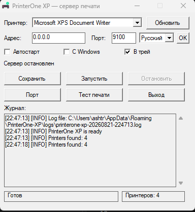

# PrinterOne for Windows XP

This directory is an isolated Windows XP SP3 (x86) implementation. It does not
import Wails or the modern desktop module and has no third-party dependencies.

The executable contains its application icon as a native 386 PE resource. The
same icon is used by Explorer, the main window and the notification area.

The compact native interface supports Русский, English, Deutsch and Español.
Select a language next to the port field and click the adjacent `OK` button.
PrinterOne XP saves the language and immediately restarts to apply it.

## Screenshots

### Compact interface

### Running on Windows XP SP3

### Verified RAW printing on Windows XP SP3

## Local development build

Run `./build-local.ps1`. This validates the source and produces a 32-bit Windows
executable with the locally installed Go compiler. Such a binary is only a smoke
artifact when the compiler is newer than Go 1.10.8; it is not XP-compatible.

## XP-compatible build

Extract the official Go 1.10.8 Windows archive into
`.toolchains\go1.10.8\go`, then run `./build-xp.ps1`. A different toolchain path
can be passed with `-GoRoot`. The script stages the source in a temporary GOPATH because Go
1.10 predates module support and writes `build/PrinterOne-XP-SP3-x86.exe`.

## Runtime data

- Configuration: `%APPDATA%\PrinterOne-XP\config.json`
- Logs: `%APPDATA%\PrinterOne-XP\logs\printerone-xp-*.log`
- Default endpoint: `0.0.0.0:9100`

The XP build intentionally does not change Windows Firewall settings. If the
firewall is enabled, allow inbound TCP traffic for the configured port manually.

## Releases

`.github/workflows/legacy-xp.yml` runs the Go 1.10.8 tests and build independently
from the Wails job. Every `v*` tag uploads `PrinterOne-XP-SP3-x86.exe` and its
SHA-256 file to the same GitHub Release as the modern Windows build.
